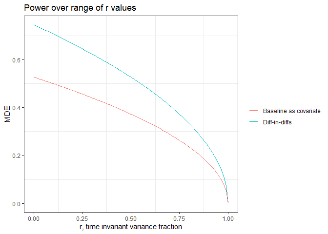
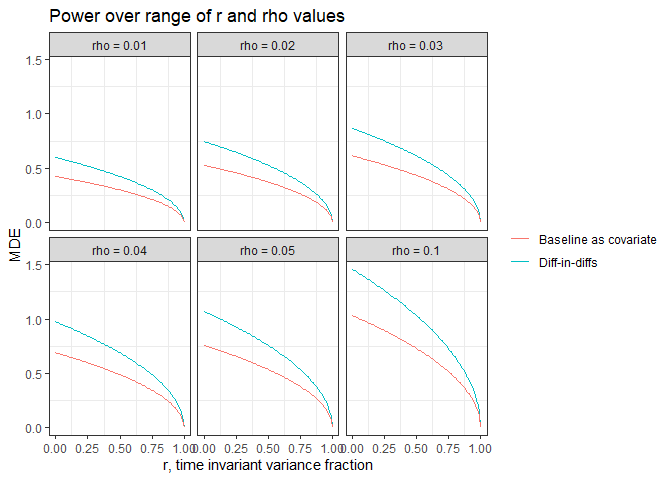

# Estimating the likely power and minimal detectable effect sizes of our study

Here, I walk through several methods for conducting power analyses. Power analysis grows more complex as our design grows more complex. Nearly any of the models we intend to run are complex enough that no off-the-shelf method for conducting power analyses will suffice. As a preliminary step, I thus perform a power analysis of perhaps the simplest sort we might do and still stay close to our design. I look at our likely power to detect an effect for a change in perceived stress in our survey. In this case, we are dealing with repeated measures (pre- and post-) on individual subjects within clusters. This is already more complicated than textbook examples; below I suggest ways we could try to make the power analysis more to true to reality. 

The good news is that because we will have pre and post observations, clustering should be less of a concern than if we only had a single cross-section.

The bad news is that the standard ICC no longer works. We don't just have to account for the time invariant effects of clusters but also the time invariant effects due to individual subjects' idiosyncracies. We therefore need a more complex ICC, which requires more parameters and/or data to be estimated.

I see three ways forward:

1. Take the paramters that we can get from existing studies (e.g., *Kossek et al. 2017*)
2. Use underlying data from an existing study
3. Simulate our own data

In what follows, I attempt 1 and 3. The middle option, 2, might actually be the easiest if we had some real data to work with. (Note: we'd just be using this data to get a few more summary statistics than the usual ones reported in a journal article.)

## Using parameters from existing studies

Here I conduct a power analysis using formulas provided by McConnell and Vera-Hernandez (2015). 

The minimum detectable effect (MDE) for a difference-in-differences with two periods is:

$$\delta = \sqrt{\frac{2\sigma_22(1 - r)(t_{\alpha/2} t_{\beta})^2 (1 + (m - 1)\rho)}{ mk}}$$

And for a model that includes the baseline outcome as a covariate:

$$\delta = \sqrt{\frac{2\sigma_2(1 - r)(t_{\alpha/2} t_{\beta})^2 (1 + (m - 1)\rho)}{ mk}}$$

Note that in the second equation, the coefficient before $(1-r)$ is dropped, which has the desirable affect of reducing the MDE.

The ICC is captured by $\rho$, which in this case is equal to:

$$\rho = \frac{\sigma_{c}^2 + \sigma_{ct}^2}{\sigma_{c}^2 + \sigma_{ct}^2 + \sigma_{p}^2 + \sigma_{pt}^2}$$

where $\sigma_{c}^2$ and $\sigma_{ct}^2$ are equal to the time-invariant between cluster variance and time-varying within cluster variance and $\sigma_{p}^2$ and $\sigma_{pt}^2$ are equal to the time-invariant between persion variance and time-varying within person variance. These can be decomposed into person and cluster autocorrelation:

$$ 
\begin{array}
{ccc}
\rho_c = \frac{\sigma_{c}^2}{\sigma_{c}^2 + \sigma_{ct}^2} & \text{and} & \rho_p = \frac{\sigma_{p}^2}{\sigma_{p}^2 + \sigma_{pt}^2}
\end{array}
$$

The parameter $r$, the fraction of the total variance composed of by the time invariant components, is equal to:

$$r = \frac{m\rho}{1 + (m - 1)\rho}\rho_c + \frac{1-\rho}{1 + (m - 1)\rho}\rho_p$$
By conditioning on the baseline value of the outcome variable, we are netting out the time invariant component of the variance (which is large when $r$ is close to 1).

To use these equations to estimate an MDE, we need to set several parameters. These are:

Number of clusters, $k$:

```r
k <- 24
```

Number of observations in each cluster, $m$:

```r
m <- 122
```

Degrees of freedom, $df$:

```r
df <- 2 * (k - 1)
```

The significance level, $\alpha$

```r
alpha <- 0.05
t_alpha <- abs(qt((alpha / 2), df))
```

Power, $\beta$

```r
beta <- 0.80
t_beta <- abs(qt((beta / 2), df))
```

Variances. This is where things get tricky. We don't have an estimate for each variance. What I will attempt to do is set one variance based on Kossek et al. (2017) and then play around with the others. Note that I am not entirely sure I am using the Kossek values correctly. 

\setlength{\leftskip}{2cm}

Overall variance, $\sigma^2$, can, I believe, be derived using Kossek et al. 2017, Table 2. That is, we sum the variance of the baseline and 6-month outcome because 
$$var(x + y) = var(x) + var(y) + cov(x, y)$$
and because--and this where I am not certain--we can derive the covariance from the correlation provided in Table 2:
$$corr = \frac{cov(x, y)}{\sigma_x \sigma_y}$$
I treat $x$ as baseline perceived stress ($\mu$ = 9.51, $\sigma$ = 3.08) and $y$ as 6-months perceived stress ($\mu$ = 9.25, $\sigma$ = 2.93), and $corr$ is equal to 0.56. Hence, 

$$cov(x, y) = .56 \cdot 3.08 \cdot 2.93 = 5.053664$$
and


```r
sigma2 <- (3.08)^2 + (2.93)^2 + 5.053664
```

\setlength{\leftskip}{0pt}

The ICC, \rho, which for now we will assume a set value.

```r
rho <- 0.02
```

The fraction of the total variance composed of by the time invariant components, $r$, which we will allow to vary because we don't have good values which to estimate it:

```r
r <- seq(0, 1, .01)
```

Together, these allow us to estimate the MDE, $\delta$:

```r
# For diff-in-diffs
delta_dd <- sqrt((2* sigma2 * 2 *(1 - r) * (t_alpha + t_beta)^2 * (1 + (m - 1) * rho)) / (m*k))

# For pretreatment as covariate
delta_cov <- sqrt((2* sigma2 * (1 - r) * (t_alpha + t_beta)^2 * (1 + (m - 1) * rho)) / (m*k))
```

We can see how $\delta$ varies over ranges of $r$.

And we can see how $\delta$ varies over ranges of $r$ and $\rho$.

## References

* Kossek
* McDonell
